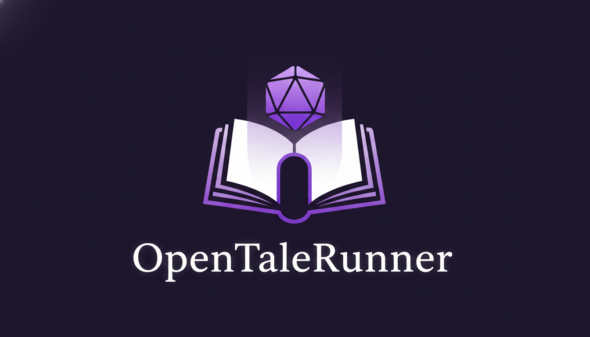
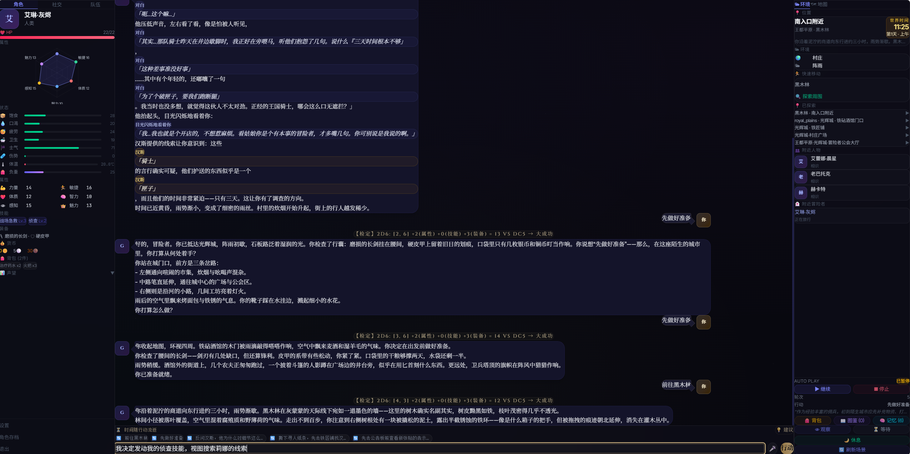
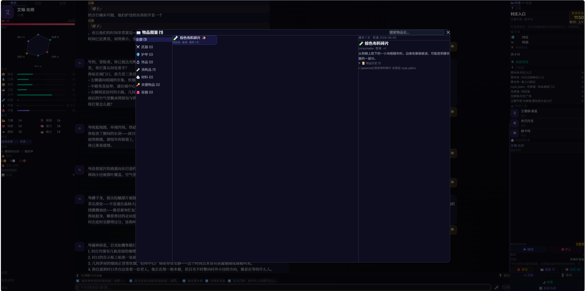
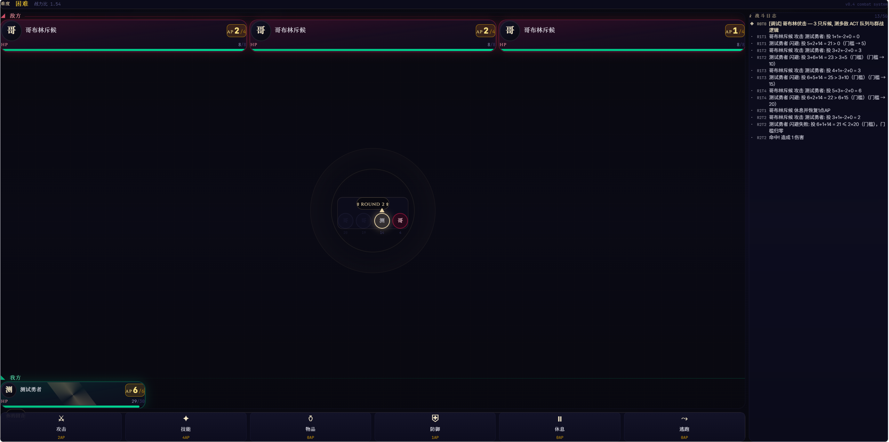

> **叙事驱动一切。** 这不是预先写好的剧本——这是一个由 AI 与你共同编织的、永不停歇的传说。
<p align="center">
  
</p>


[](LICENSE)
[](https://react.dev)
[](https://fastapi.tiangolo.com)
[](docs/)
[](client/)
[](CHANGELOG.md)

[English Version](./README_EN.md) · [更新日志](./CHANGELOG.md)

---

> 本项目**利用AI Agent 编码完成。**但所有的游戏玩法、架构设计、测试用例、设计文档均为个人思考的结果。当前项目用大量**自动化测试**和**设计文档**来保证功能的稳定迭代。欢迎各位以同样的方式也使用AI Agent参与贡献（请不要过度投入自己的时间）。

---

## 愿景

**"梦到什么，就是什么。"**

这里有剑与魔法，也有星舰与深渊，反正啥都有，因为都是你想出来的。和GM一起创造属于自己的故事(请不要将GM变成猫娘)。

---

## 玩法：最基础的，是文字冒险

OpenTaleRunner的起点，是一场文字冒险。

GM描述你所在的场景，并附带给出几个选择。

- 可以点选其中之一
- 也可以梦到什么说什么！

GM会给你来一个经典的骰子判定，然后就可能有惊喜的大成功和惊吓的大失败。

**你的每个选择都在塑造这个世界。**

这个世界记得你的足迹：

- 服务器整合客户端故事
- NPC记忆独立存储
- 物品图鉴系统

---

## 特点

### 叙事驱动一切

代码不预设任何物品、NPC或剧情。**所有内容由GM叙事当场决定**：

- 武器没有预设属性——GM描述它锋不锋利，代码只记录它造成的伤害
- NPC没有预设台词——GM现在想到什么，NPC就说什么
- 事件没有预设分支——GM根据你的行动，实时生成世界对你的回应

### GM按需查询，而非全量注入

传统方案把整个世界的状态塞进Prompt——你的背包、NPC列表、任务进度、地图……OpenTaleRunner的GM只在需要的时候才查询：

> `GM正在回想你遇到的 NPC...` → 只查询相关 NPC 信息 → 叙事返回

**按需查询**：背包、NPC、地点、角色状态、技能、近期事件、世界观。减小每次交互的Token消耗。

### 自由更换世界观

OpenTaleRunner的世界由**Storybook**格式定义——一个JSON文件，包含区域、角色、任务、物品模板。你可以：

- 用默认的艾瑟兰世界体验
- 自行设计并分享你的世界观（Storybook JSON）

**剑与魔法，赛博朋克，克苏鲁，修仙，废土——任何世界观，一键替换。**

### 多人实时联机或异步探索(跑团只有一个人有什么意思？)

- 实时联机：由房主创建房间，一起众乐乐。
- 异步探索：多名玩家可以在同一个世界中冒险。每个人的行动都会被编年史引擎记录，塑造共享的世界。其他玩家的角色会以"幽灵NPC"的形式出现在你的世界中。

### 世界看板（未完全实现）

服务端附带一个Web看板（`localhost:8081`），从上帝视角了解世界的发展，查看当前世界每天的事件、NPC状态、玩家角色经历等等，甚至包括玩家/NPC实时位置世界地图。
在客户端里的冒险终将成为岁月史书的一部分。

---

| | |
|---|---|
|  |  |
| **文字冒险** — 核心玩法。GM叙事驱动一切，你来决定下一步。 | **骰子判定** — 每次行动由2d6 + 修正值实时判定结果。 |
|  |  |
| **图鉴系统** — 所有发现过的物品、历史与品质记录。 | **战斗系统** — ACT 回合制战斗，6维属性公式 + 闪避衰减。 |

---

## 快速开始

### 本地开发

**前置**: Node.js 22+ / Python 3.12+ / AI API Key

```bash
# 客户端
cd client && npm install && npm run dev

# 服务端（可选，联网功能需要）
cd server && pip install -r requirements.txt
SERVICE_JWT_SECRET=dev-secret python run.py
```

### AI API KEY

当前存在3种Agent可以在设置菜单中填写：
- 故事叙事GM（必填）
- NPC立绘、地形图像生成（选填, 开发中）
- 旁白与NPC配音(选填, 开发中)

---

## 技术栈

| 层 | 客户端 | 服务端 |
|---|---|---|
| 语言 | TypeScript (strict) | Python 3.12 |
| 框架 | Vite + React 19 | FastAPI + uvicorn |
| 状态管理 | Zustand (persist + 加密) | Python 原生 |
| 数据库 | IndexedDB / localStorage | SQLite 21 张表 (aiosqlite) |
| AI 调用 | 6 LLM Provider 直连 | 仅编年史聚合（低频） |
| 判定 | `crypto.getRandomValues()` | — |
| 测试 | Vitest (852 用例, 68 文件) | pytest |

---

## 功能地图

| 系统 | 说明 | 文档 |
|---|---|---|
| **PM 引擎** | 7 层 Prompt、多轮查询、流式输出、Token 预算 | [📄](docs/zh/PM引擎与Prompt系统.md) |
| **判定系统** | 2d6 + 7 种修饰符、夜间惩罚、15 种条件 | [📄](docs/zh/判定系统.md) |
| **角色系统** | 六维属性、技能、HP/精力、名誉、六步创建 | [📄](docs/zh/角色系统.md) |
| **物品系统** | 7 分类、6 品质、11 效果、背包/装备、历史追踪 | [📄](docs/zh/物品系统.md) |
| **多人联机** | 房间 1-10 人、回合制、观战、18 API 端点 | [📄](docs/zh/多人联机系统设计文档.md) |
| **NPC 系统** | 模板生成、幽灵 NPC、FSM 调度、交互检测 | [📄](docs/zh/NPC系统.md) |
| **队伍系统** | NPC 招募、忠诚度、战斗/辅助能力 | [📄](docs/zh/队伍系统设计文档.md) |
| **故事书** | JSON Schema 世界观、区域/任务/角色模板、热替换 | [📄](docs/zh/故事书Schema与替换指南.md) |
| **Hook 系统** | 17 条规则 5 类别、热插拔、错误隔离 | [📄](docs/zh/GameRuleEngine中间件设计文档.md) |
| **编年史** | 行动记录、聚合引擎、世界日推进、离线缓冲 | [📄](docs/zh/编年史系统.md) |
| **AutoPlay** | AI 决策引擎、LLM 循环、JSON 解析回退 | [📄](docs/zh/AutoPlay系统.md) |
| **媒体能力** | TTS 3 Provider + 语音池 · Image 3 Provider · STT 4 Provider | [📄](docs/zh/媒体能力.md) |
| **安全系统** | AES-GCM 加密、Prompt 注入防护、XSS、JWT | [📄](docs/zh/安全系统.md) |
| **日志系统** | 客户端 12 分类 IndexedDB · 服务端 RotatingFileHandler | [📄](docs/zh/日志系统.md) |
| **战斗系统** | ACT 回合制、6 维公式、闪避衰减、QTE | [📄](docs/zh/战斗系统.md) |

---

## 项目结构

```
OpenTaleRunner/
├── client/                     # 前端 React + TypeScript (68 测试文件, 852 用例)
│   └── src/
│       ├── components/         # 游戏区 / 三栏布局 / 模态框 / 面板
│       ├── hooks/              # usePMEngine / useAutoPlay / useVoiceInput
│       ├── services/
│       │   ├── engine/         # PMEngine · PromptBuilder · QueryResolver · TokenBudget
│       │   ├── judgment/       # 判定系统 · 条件注册表
│       │   ├── chronicle/      # 编年史记录器
│       │   ├── consequence/    # 后果落地引擎
│       │   ├── sync/           # HttpClient · APIClient · SyncManager
│       │   ├── multiplayer/    # 多人 API · 同步服务
│       │   ├── combat/         # 战斗系统 (ACT 队列 / ActionResolver / 平衡评估)
│       │   ├── tts/ image/ stt/# 媒体能力 (12 Provider 实现)
│       │   ├── npc/ autoPlay/  # NPC 生成器 · AutoPlay 引擎
│       │   ├── crypto/         # AES-256-GCM 加密
│       │   ├── security/       # Prompt 注入防护 · XSS 过滤
│       │   ├── logging/        # 12 分类调试日志 (IndexedDB)
│       │   └── event/          # 14 事件发布订阅总线
│       ├── stores/             # Zustand stores 状态管理
│       └── types/              # TypeScript 类型定义
│
├── server/                    # 后端 Python FastAPI
│   ├── routers/                # 79 REST 端点 (13 路由文件)
│   ├── services/               # 编年史聚合 · 冲突检测 · 幽灵管理 · NPC 行为调度
│   ├── repositories/           # 数据访问层 (接口 + SQLite 实现)
│   ├── models/                 # Pydantic 请求/响应模型
│   ├── db/                     # 21 张表 DDL + 种子数据
│   └── dashboard/              # 世界看板 (独立 FastAPI 8081)
│
├── docs/                       # 40+ 篇系统文档 (中文 + 英文)
├── .github/                    # CI/CD · Issue 模板 · PR 模板 · CODEOWNERS
└── .gitignore                  # Git 忽略规则
```

---

## 社区

| | |
|---|---|
| 更新日志 | [CHANGELOG.md](./CHANGELOG.md) |
| License | [MIT](LICENSE) |

---

> *"代码只是容器，GM的叙事才是灵魂。"*
